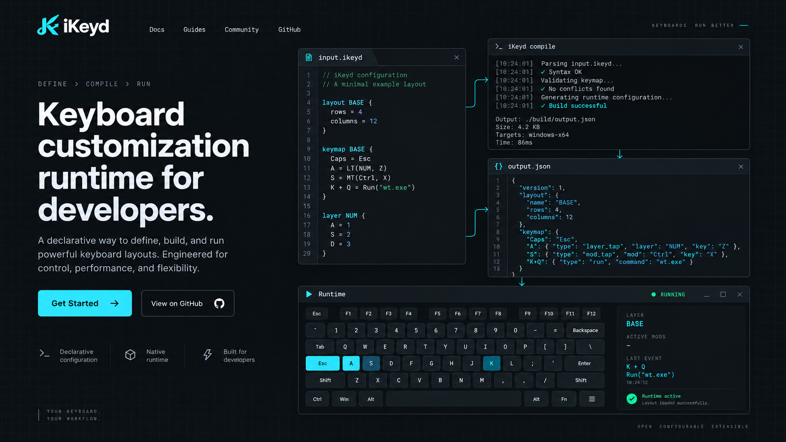
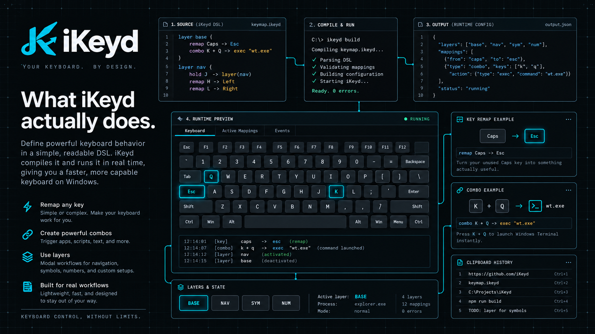
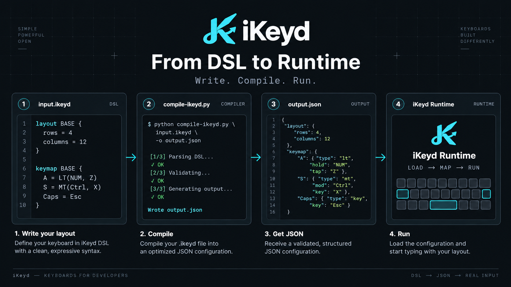

# iKeyd brand direction

## Name

**iKeyd**

Public naming line:

> **I Key'd / I keyed it my way.**

The product idea is simple: make the keyboard behave *your* way.

## Official assets

The following PNG files are the current, official iKeyd artwork. Use the files as-is: do not redraw, recolor, distort, crop, or add effects or text.

### Application icon

  

`ikeyd-icon.png` is the canonical application and brand icon.

The Windows executable and tray icon use `src/iKeyd.App/Assets/ikeyd.ico`, generated from the same artwork.

### Logo / wordmark

  

`ikeyd-logo.png` is the canonical combined logo and wordmark.

## Visual direction

The visual language should feel like a real developer tool, not an AI-product mascot brand.

- Dark, restrained developer-workspace imagery.
- A keyboard or its physical key geometry should remain the visual protagonist.
- Use one cool blue/cyan accent rather than rainbow effects.
- Prefer crisp interface annotations, keymaps, layers, combos, and code over decorative illustration.
- Keep typography simple, spacious, and technical.
- Avoid 3D mascots, glossy robot characters, excessive gradients, floating magic particles, or generic “AI future” imagery.

The supporting art should harmonize with the official icon without trying to redraw it. The icon remains the identity; README/website artwork supplies the environment around it.

## Core palette

| Role | Value |
| --- | --- |
| Background | `#0B0F14` |
| Primary blue | `#2563FF` |
| Cyan accent | `#55E6F3` |
| Primary text | `#E5E7EB` |
| Secondary text | `#6B7280` |

The palette is intentionally small. Blue/cyan is for focus, active keys, links, and small brand marks. The official icon and logo must retain the colors in the supplied PNG files.

## Typography

- Latin: **Inter** or a clean system sans-serif.
- Japanese: **Noto Sans JP** or the platform system sans-serif.
- Code: the repository/editor default monospace stack.

## Messaging

Primary:

- **I Key'd / I keyed it my way.**
- **Your keyboard, your workflow.**
- **キーの可能性を、もう一度設計する。**

Secondary:

- **Good Keys. Better Developers.**

## README visual set

The README uses a small family of matching illustrations instead of one isolated hero image.

  

  

  

## Assets

Brand assets live in `docs/assets/brand/`.

- `ikeyd-icon.png` — canonical official application / brand mark.
- `ikeyd-logo.png` — canonical official logo / wordmark.
- `readme-hero.png` — README hero artwork.
- `readme-features.png` — README feature overview.
- `readme-dsl.png` — README DSL/compiler flow.
- `src/iKeyd.App/Assets/ikeyd.ico` — Windows executable and tray icon, generated from `ikeyd-icon.png`.

Future website, release, and OGP images should reuse these official assets and make the official mark the primary identifier rather than inventing a separate logo for each surface.

